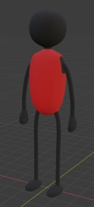
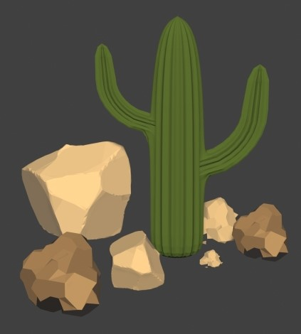
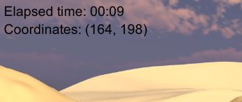
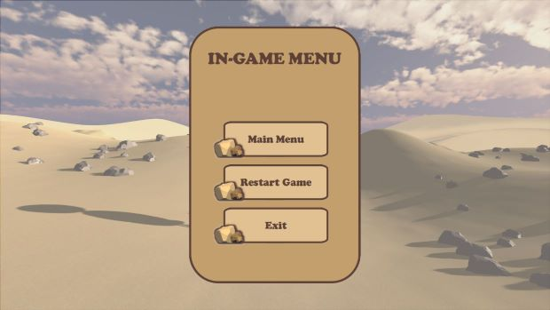
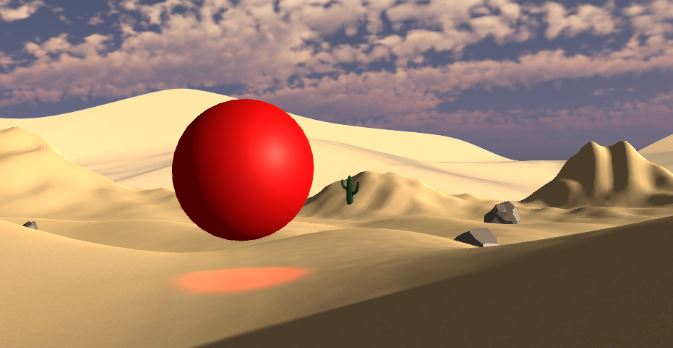

# VR project Altec - Enea Guarneri
## Candidate: Enea Guarneri
VR project for the Synergie - Altec selection path.

This task requires the creation of a 3D interactive scene set in a desert. The main objective is to control
an animated character to reach a specific randomly generated area within the scene.
The scene must have the following characteristics:
- An animated character with a skeleton
    - Main character was modeled in _Blender_ from scratch by myself. Skeleton and animations were made thank to _Mixamo_ web tool, in order to get smooth player movements and to save time for design and programming phases. 
    

- Desert terrain with rocks.
    - The desert landscape was made by the Unity _Terrain_ tool. Rocks was modeled in _Blender_ by myself, providing 2 different styles. Again with the _Terrain_ tool, I generated some rocks randomly in the scene. For beauty purposes, I also modeled a cactus object to put it in the game scene. 
    

- Character movement must be controlled by keyboard
    - Movements are triggered by the combination of "WASD" or arrows keys on the keyboard. Is <b>Not</b> possible for the player character to jump by design (i.e. hitting "Spacebar" key). Instead, user can make the character run and move faster by holding the "Left Shift" key.
- There must be 1 camera with position relative to the main character.
    - Only 1 camera is used in the game scene and it points to the back of the character by default.
- Camera movement must be controlled by mouse. Zooming must be done by scroll.
    - Camera movement is tracked by the relative position of the mouse. In order to enhance the control of character view, <b>user can move the camera only if he holds the "Right button" of the mouse.</b> Zoom is obtained by changing the FOV of the Camera object after each scroll action; for this reason, the FOV value range was reduced to avoid bad artifacts (i.e. character vanishing or scene view stretching).
- There must be a user interface in the scene showing the current position of the character and the elapsed time.
    - This simple UI is placed in the top-left corner of the display. It shows the elapsed time in "_mm:ss_" format and the current position of the character in "_(X,Z)_" format, according to the playable area size: in my solution, the game area is a 500x500 Unity units square (x and z Unity coordinates).
    

- It must be possible to open a menu in the scene containing options to return to the first scene, reset the current scene and close the application. 
    - This action is possible by pressing the "Esc" key on the keyboard. <b>All UI Buttons were drawn by myself and imported in the project.</b> The "in-game menu" can be closed only pressing once again the "Esc" key.
    

- The objective of the scene must be to reach a predetermined, randomly generated area within the scene. When the character enters the area, the scene must provide a completion message and the option to return to the main menu.
    - For "predetermined, randomly generated area" was assumed that, at the beginning of every round, a certain 3D point on the ground is extracted randomly and becomes the target point to be reached in order to complete the round. The design choice to reach the "predetermined" assumption in the previous phrase is explained in the following steps:
        1. at the beginning of every round, the playable area is divided in 4 subareas (quarters);
        2. one of these 4 areas is extracted randomly and afterwards the player is placed at the center of that slice, always facing the center of the whole playable area;
        3. couples of coordinates are extracted repeatedly until one of these random couples doesn't figure in a "correct" position on the whole area. _A position is correct if it doesn't belong to the extracted quarter area._
    - The randomly extracted 3D point is represented by a _floating big red sphere_, just to make it easier for the user to locate each new round objective.
    

